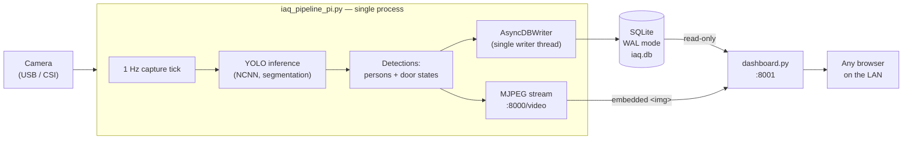

# IAQ Door & Occupancy Monitor — Raspberry Pi 4

A self-contained system that watches a camera feed with a YOLO segmentation model, tracks door open/closed state per machine and live person count, logs everything to a local SQLite database once per second, and serves a live web dashboard — all running on a single Raspberry Pi 4, no cloud dependency required.

| | |
|---|---|
| **Hardware** | Raspberry Pi 4 (4GB+ recommended), USB or CSI camera |
| **OS** | Raspberry Pi OS Bookworm, 64-bit |
| **Language** | Python 3.11+ |
| **Inference** | Ultralytics YOLO (segmentation), exported to NCNN for ARM CPU |
| **Storage** | SQLite (WAL mode) |
| **Dashboard** | Flask + vanilla JS + self-hosted Chart.js |

---

## Table of Contents

- [Architecture](#architecture)
- [Repository Layout](#repository-layout)
- [Hardware & Software Requirements](#hardware--software-requirements)
- [Quick Start](#quick-start)
- [Full Setup Guide](#full-setup-guide)
  - [1. Prepare the Raspberry Pi](#1-prepare-the-raspberry-pi)
  - [2. Install system packages](#2-install-system-packages)
  - [3. Copy the project onto the Pi](#3-copy-the-project-onto-the-pi)
  - [4. Python environment](#4-python-environment)
  - [5. Prepare the SQLite database](#5-prepare-the-sqlite-database)
  - [6. Export and configure the YOLO model](#6-export-and-configure-the-yolo-model)
  - [7. Verify the camera in isolation](#7-verify-the-camera-in-isolation)
  - [8. Verify the model in isolation](#8-verify-the-model-in-isolation)
  - [9. Choose a counting mode](#9-choose-a-counting-mode)
  - [10. Run the pipeline (foreground test)](#10-run-the-pipeline-foreground-test)
  - [11. Run the dashboard](#11-run-the-dashboard)
  - [12. Install as background services](#12-install-as-background-services)
- [Configuration Reference](#configuration-reference)
- [Verifying a Healthy Deployment](#verifying-a-healthy-deployment)
- [Troubleshooting](#troubleshooting)
- [Performance Notes for Pi 4](#performance-notes-for-pi-4)
- [Data Retention & Backups](#data-retention--backups)
- [Known Limitations](#known-limitations)
- [License](#license)

---

## Architecture

One camera, one model instance, one writer process — everything else reads from the database.



**Why this shape, specifically:**
- **One process owns the camera.** Running a separate video-preview process and the DB-writing pipeline at the same time causes camera contention — most drivers only allow one exclusive reader. Streaming is built into the pipeline itself instead.
- **One writer, one SQLite connection.** SQLite's WAL mode allows only one writer to hold the file lock at a time; giving every table its own connection caused intermittent `database is locked` errors under load. A single `AsyncDBWriter` thread serializes all writes across all four tables.
- **The dashboard never writes.** It opens the database in read-only mode, so it can never contend with or corrupt what the pipeline is doing, and can be restarted independently at any time.

---

## Repository Layout

```
iaq_pipeline/
├── .gitignore
├── iaq_pipeline_pi.py      # Main process: camera + YOLO + DB writer + live stream
├── db_writer.py             # SQLite schema + single-writer async DB layer
├── dashboard.py              # Flask web dashboard (reads DB, embeds live stream)
├── schema.sql                 # Plain-SQL schema (for manual/CLI setup, no Python needed)
├── roi_calibrator.py        # Optional: draw a specific counting zone on your camera
├── export_model.py           # One-time: converts trained .pt weights to NCNN
├── test_camera.py             # Standalone camera smoke test
├── test_model.py               # Standalone model smoke test (with annotated output)
├── query_db.py                  # CLI helper to inspect the database without SQL
├── requirements.txt
├── static/
│   └── chart.umd.js          # Self-hosted Chart.js (no CDN/internet dependency)
├── iaq-pipeline.service      # systemd unit — main pipeline
└── iaq-dashboard.service     # systemd unit — dashboard
```

`live_stream.py`, if present from earlier development, is now superseded by the streaming built into `iaq_pipeline_pi.py` — keep it only as a standalone diagnostic tool when the main pipeline isn't running, never alongside it (camera contention).

---

## Hardware & Software Requirements

- Raspberry Pi 4, 4GB RAM minimum (8GB gives more headroom for inference)
- A USB webcam, CSI camera module, or an RTSP-capable IP camera
- microSD card (16GB+) or, preferably, a USB SSD — see [Performance Notes](#performance-notes-for-pi-4) on why this matters
- Raspberry Pi OS **Bookworm, 64-bit** (`cat /etc/os-release` to confirm)
- Network access from at least the viewing device (phone/laptop) to the Pi — the Pi itself does **not** need internet once dependencies are installed and the model is on disk
- A trained YOLO segmentation model (`best.pt`) with these exact class names: `person`, `machine_{1,2,3}_door_open`, `machine_{1,2,3}_door_closed`

---

## Quick Start

For readers who want the command list first and the explanations after. Every step here is expanded with verification checks in the [Full Setup Guide](#full-setup-guide) below — **first-time setup should follow that section, not this one.**

```bash
# On the Pi
mkdir -p /home/pi4/iaq_pipeline /home/pi4/iaq_data
cd /home/pi4/iaq_pipeline
python3 -m venv venv && source venv/bin/activate
pip install -r requirements.txt

sqlite3 /home/pi4/iaq_data/iaq.db < schema.sql

# On a dev machine (faster than exporting on-Pi)
python3 export_model.py --weights best.pt --imgsz 480 --task segment
# copy the resulting best_ncnn_model/ folder to the Pi, update MODEL_PATH in iaq_pipeline_pi.py

# Back on the Pi
python3 iaq_pipeline_pi.py          # foreground test — Ctrl+C to stop
python3 dashboard.py --port 8001    # separate terminal

# Once both work correctly:
sudo cp iaq-pipeline.service iaq-dashboard.service /etc/systemd/system/
sudo systemctl daemon-reload
sudo systemctl enable --now iaq-pipeline iaq-dashboard
```

Open `http://<PI_IP_ADDRESS>:8001` from any device on the network.

---

## Full Setup Guide

### 1. Prepare the Raspberry Pi

Flash **Raspberry Pi OS (64-bit) Bookworm** using Raspberry Pi Imager, enable SSH during imaging, and boot the Pi.

```bash
ssh pi4@<PI_IP_ADDRESS>
cat /etc/os-release | grep VERSION
python3 --version
```
✅ Expect Bookworm and Python 3.11+.

### 2. Install system packages

```bash
sudo apt update && sudo apt upgrade -y
sudo apt install -y python3-venv python3-pip sqlite3 v4l-utils git
```
✅ `sqlite3 --version` should print 3.35 or newer.

### 3. Copy the project onto the Pi

```bash
mkdir -p /home/pi4/iaq_pipeline /home/pi4/iaq_data
```
Transfer every file from [Repository Layout](#repository-layout) into `/home/pi4/iaq_pipeline/`, preserving the `static/` subfolder. Use `scp`, a USB drive, or `git clone` — whichever fits your workflow.

```bash
ls /home/pi4/iaq_pipeline/
```
✅ All files listed above should be present, including `static/chart.umd.js`.

### 4. Python environment

```bash
cd /home/pi4/iaq_pipeline
python3 -m venv venv
source venv/bin/activate
pip install --upgrade pip
pip install -r requirements.txt
```
This step is slow on a Pi 4 (10–20 minutes is normal for `ultralytics` and its dependencies).

```bash
python3 -c "import ultralytics, cv2, supervision, flask; print('all imports OK')"
```
✅ Prints `all imports OK` with no errors.

### 5. Prepare the SQLite database

No Python required for this step — pure SQL, using the schema file directly:

```bash
sqlite3 /home/pi4/iaq_data/iaq.db < schema.sql
sqlite3 /home/pi4/iaq_data/iaq.db ".tables"
```
✅ Lists `ct_vectors`, `per_second_analytics`, `tracking_telemetry`, `raw_detections`.

```bash
sqlite3 /home/pi4/iaq_data/iaq.db "PRAGMA journal_mode;"
```
✅ Prints `wal`.

If you're on a microSD card rather than a USB SSD, this is the point to be aware that `db_writer.py` already batches commits (every ~10s or 200 rows) specifically to reduce flash wear — no action needed, just worth knowing why writes aren't committed instantly.

### 6. Export and configure the YOLO model

Confirm the trained model's real task before exporting — don't assume:
```bash
python3 -c "from ultralytics import YOLO; m = YOLO('best.pt'); print('task:', m.task)"
```

Export to NCNN (do this on a faster dev machine if possible, then copy the output folder to the Pi):
```bash
python3 export_model.py --weights best.pt --imgsz 480 --task segment
```
> **Why `--task` matters:** NCNN export can silently lose the model's task metadata. Loading a segmentation model without explicitly specifying `task="segment"` causes Ultralytics to misinterpret the output tensor — symptoms are hundreds of garbage detections, confidence values above 1.0, and unrecognized class IDs. Always pass `--task` explicitly at both export and load time.

Copy the resulting `best_ncnn_model/` folder to the Pi, then edit the top of `iaq_pipeline_pi.py`:
```python
MODEL_PATH = "/home/pi4/yolo/models/best_ncnn_model"
MODEL_TASK = "segment"
```

### 7. Verify the camera in isolation

```bash
python3 test_camera.py --source 0
```
✅ Reports a real resolution and fps, and saves a JPEG you can inspect. **Do not proceed until this works** — nothing downstream can succeed without it.

If `0` isn't the right device:
```bash
ls /dev/video*
v4l2-ctl --list-devices
```

### 8. Verify the model in isolation

```bash
python3 test_model.py --model /home/pi4/yolo/models/best_ncnn_model \
  --image /home/pi4/iaq_data/camera_test.jpg --task segment
```
✅ No `Unable to automatically guess model task` warning. Detection count is small and realistic (not hundreds). An annotated image is saved next to the input — pull it off the Pi and confirm the boxes look correct:
```bash
scp pi4@<PI_IP_ADDRESS>:/home/pi4/iaq_data/camera_test_annotated.jpg .
```

### 9. Choose a counting mode

Two options, set at the top of `iaq_pipeline_pi.py`:

| Mode | Setting | Behavior |
|---|---|---|
| **Whole frame** (default) | `COUNT_ENTIRE_FRAME = True` | Counts every person detected anywhere in the camera's view. No calibration needed. |
| **Specific zone** | `COUNT_ENTIRE_FRAME = False` | Counts only people inside a hand-drawn polygon (e.g., near one machine). Requires calibration. |

If you need zone-restricted counting, calibrate it on your **actual** camera and resolution — never reuse a polygon drawn on different footage:
```bash
python3 roi_calibrator.py --source 0
```
Open `http://<PI_IP_ADDRESS>:8002`, click points around the zone, click **Generate PERSON_ROI code**, paste the output over `PERSON_ROI` in `iaq_pipeline_pi.py`.

### 10. Run the pipeline (foreground test)

```bash
python3 iaq_pipeline_pi.py
```
✅ Console shows `Live stream running at: http://<PI_IP_ADDRESS>:8000` and, roughly once per second, a line like:
```
[tick 13:05:01] persons_detected=1  in_zone=1
```
Watch for `⚠ tick took Xs (target 1.0s)` warnings — if these appear on nearly every tick, see [Performance Notes](#performance-notes-for-pi-4).

Let it run 60–90 seconds, then `Ctrl+C`, and confirm data actually landed:
```bash
sqlite3 /home/pi4/iaq_data/iaq.db "SELECT COUNT(*) FROM tracking_telemetry;"
sqlite3 /home/pi4/iaq_data/iaq.db "SELECT Timestamp_ISO8601, M1_State_Debounced, Zone_Count FROM tracking_telemetry ORDER BY id DESC LIMIT 5;"
```
✅ Real, recent, increasing timestamps; `Zone_Count` changes when someone is actually on camera.

### 11. Run the dashboard

In a second terminal:
```bash
cd /home/pi4/iaq_pipeline
source venv/bin/activate
python3 dashboard.py --db /home/pi4/iaq_data/iaq.db --port 8001
```
Open `http://<PI_IP_ADDRESS>:8001` from any device on the same network.

✅ Live video appears top-left; machine status cards and the person-count card update; the pipeline-health badge shows green "running".

### 12. Install as background services

Once steps 10–11 both work correctly in the foreground, make them permanent:

```bash
sudo cp iaq-pipeline.service iaq-dashboard.service /etc/systemd/system/
sudo systemctl daemon-reload
sudo systemctl enable --now iaq-pipeline
sudo systemctl enable --now iaq-dashboard
sudo systemctl status iaq-pipeline iaq-dashboard
```
✅ Both show `active (running)`. Logs:
```bash
journalctl -u iaq-pipeline -f
journalctl -u iaq-dashboard -f
```

---

## Configuration Reference

### `iaq_pipeline_pi.py`

| Setting | Default | Purpose |
|---|---|---|
| `MODEL_PATH` | `/home/pi4/yolo/models/best_ncnn_model` | Path to the exported NCNN model folder |
| `MODEL_TASK` | `"segment"` | Must match how the model was trained/exported |
| `VIDEO_SOURCE` | `0` | Camera index, device path, or RTSP URL |
| `DB_PATH` | `/home/pi4/iaq_data/iaq.db` | SQLite database file |
| `COUNT_ENTIRE_FRAME` | `True` | See [step 9](#9-choose-a-counting-mode) |
| `TARGET_TICK_SECONDS` | `1.0` | Target sampling interval |
| `INFERENCE_IMGSZ` | `480` | Inference resolution — lower is faster, less accurate |
| `PERSON_CONF` | `0.25` | Minimum confidence to count a person detection |
| `DOOR_CONF_PER_MACHINE` | per-machine dict | Minimum confidence to accept a door reading, tunable per camera distance |
| `ENABLE_LIVE_STREAM` | `True` | Serves the annotated MJPEG feed on `STREAM_PORT` |
| `STREAM_PORT` | `8000` | Must match `--stream-port` passed to `dashboard.py` |
| `DIAG_MODE` | `True` | Verbose per-tick console logging; set `False` for quieter production logs |

### `dashboard.py`

| Flag | Default | Purpose |
|---|---|---|
| `--db` | `/home/pi4/iaq_data/iaq.db` | Database to read (read-only) |
| `--port` | `8001` | Dashboard web port |
| `--stream-port` | `8000` | Must match the pipeline's `STREAM_PORT` |

---

## Verifying a Healthy Deployment

A quick checklist to run after any change or restart:

```bash
# 1. Both services running
sudo systemctl is-active iaq-pipeline iaq-dashboard

# 2. Data actively growing
sqlite3 /home/pi4/iaq_data/iaq.db "SELECT COUNT(*) FROM tracking_telemetry;"
# wait 30s, run again — count should have increased

# 3. Integrity check
sqlite3 /home/pi4/iaq_data/iaq.db "PRAGMA integrity_check;"
# expect: ok

# 4. Dashboard reachable and showing a green pipeline badge
curl -s http://localhost:8001/api/status | python3 -m json.tool
```

---

## Troubleshooting

| Symptom | Cause | Fix |
|---|---|---|
| Hundreds of detections, confidence > 1.0, unrecognized class IDs | Model task mismatch — NCNN export lost segmentation metadata | Re-export and reload with explicit `task="segment"` (see [step 6](#6-export-and-configure-the-yolo-model)) |
| `database is locked` | Multiple separate SQLite connections writing at once | Already fixed architecturally — all writes go through one `AsyncDBWriter`. If seen again, check nothing else (a stray script) is opening the DB for writing |
| Person count / `Zone_Count` always 0 despite visible detections | `PERSON_ROI` polygon drawn at a different resolution than the camera's actual capture size | Recalibrate with `roi_calibrator.py` on the real camera, or switch to `COUNT_ENTIRE_FRAME = True` |
| Dashboard page completely blank, nothing updates | A JS error (e.g. failed external script) halted the entire page script | Already fixed — Chart.js is self-hosted (`static/chart.umd.js`), and each page section now fails independently rather than blocking the rest |
| Video stream shows a red "cannot reach" error on the dashboard | `iaq_pipeline_pi.py` not running, or `STREAM_PORT` mismatch between it and `dashboard.py --stream-port` | Confirm the pipeline printed `Live stream running at...`; confirm both port values match |
| Live video and pipeline both fail intermittently when run together | Two separate processes both trying to open the camera | Don't run `live_stream.py` alongside `iaq_pipeline_pi.py` — streaming is already built into the main pipeline |
| Console repeatedly shows `⚠ tick took Xs (target 1.0s)` | Inference genuinely slower than 1 second on this hardware | See [Performance Notes](#performance-notes-for-pi-4) |
| `PRAGMA synchronous` shows unexpected values from the CLI | `synchronous` is a per-connection setting, not stored in the database file | Expected behavior — the pipeline's long-lived connection sets it correctly on every startup; CLI checks reset each time |

---

## Performance Notes for Pi 4

- **NCNN, not raw PyTorch.** This is the single biggest speed factor on ARM CPU — always export before deploying.
- **`INFERENCE_IMGSZ`**: try `480` first; drop to `384` or `320` if ticks consistently overrun 1 second.
- **`bytetrack.yaml`** over `botsort.yaml`: the latter's appearance/ReID model is redundant CPU cost here, since the pipeline already does its own cross-occlusion re-identification.
- **The pipeline reports the truth, not a guess.** If your model genuinely needs 2–3 seconds per frame on this hardware, the console will say so explicitly (`tick took 2.3s`) rather than silently dropping or faking timestamps. That number is your real achievable sampling rate — plan around it rather than the configured target.
- **SD card wear**: writes are batched (commit every ~10s / 200 rows) specifically for flash longevity. A USB SSD removes this concern entirely and is recommended for continuous 24/7 deployment.
- **Process priority**: the provided `systemd` units set `Nice=0` for the pipeline and `Nice=5` for the dashboard, so the scheduler favors inference under CPU contention.

---

## Data Retention & Backups

`raw_detections` grows fastest (one row per detected object per tick). For long-running deployments:

```bash
# Prune anything older than 90 days
sqlite3 /home/pi4/iaq_data/iaq.db "DELETE FROM raw_detections WHERE Timestamp_ISO8601 < datetime('now','-90 days');"
sqlite3 /home/pi4/iaq_data/iaq.db "VACUUM;"
```
Run `VACUUM` deliberately, not on a schedule — it's a heavy operation that temporarily needs up to 2x the database's current size in free disk space.

Backups, safe to run while the pipeline is writing:
```bash
sqlite3 /home/pi4/iaq_data/iaq.db ".backup /home/pi4/iaq_data/backups/iaq_$(date +%Y%m%d_%H%M%S).db"
```

---

## Known Limitations

- Single-camera design — one camera frame drives door state for all configured machines and the overall person count.
- SQLite is appropriate for single-Pi, single-writer deployments. For multiple Pis feeding one central store, swap `db_writer.py`'s connection for PostgreSQL (schema translates directly — see comments in that file).
- True per-second sampling is bounded by real inference speed on the hardware; see [Performance Notes](#performance-notes-for-pi-4).

---

## License

Add your license of choice here (e.g., MIT, Apache 2.0) before distributing.
